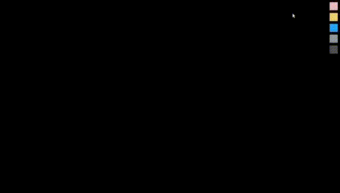

# SFML Sand Falling Game


## Elements
```Eraser``` 

```Sand``` 

```Water``` 

```Stone``` 

```Wall``` 


## Controls
Press the ```Colored Buttons``` at the top right of the screen to ```Switch Elements```.

Use the ```Scroll Wheel``` to ```increase``` and ```decrease``` the brush size.

## Building
```bash
mkdir build
cd build
cmake ..
make
./SandFallingGame
```

## Helpful Resources
[How To Make a “Falling Sand” Style Water Simulation](https://w-shadow.com/blog/2009/09/29/falling-sand-style-water-simulation/)

## License
[MIT](https://choosealicense.com/licenses/mit/)
